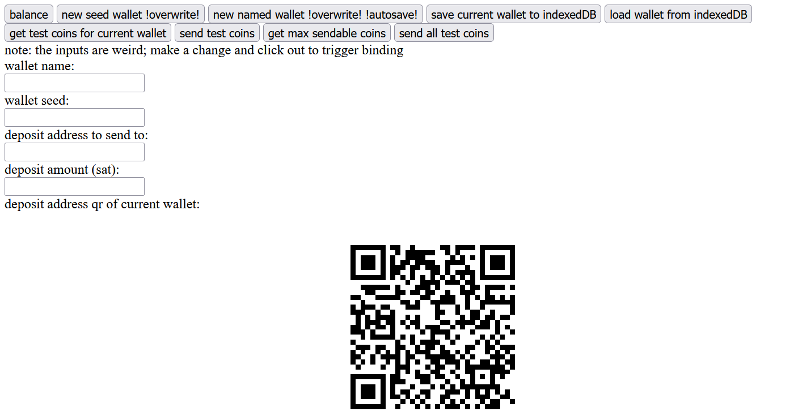

rudimentary test file for https://mainnet.cash/ api

works as of 2.2.7, no guarantees past that bc it already took a lot of wrestling with outdated docs as is
- includes usage of indexedDB storage
- https://rest-unstable.mainnet.cash/api-docs/ works sometimes

